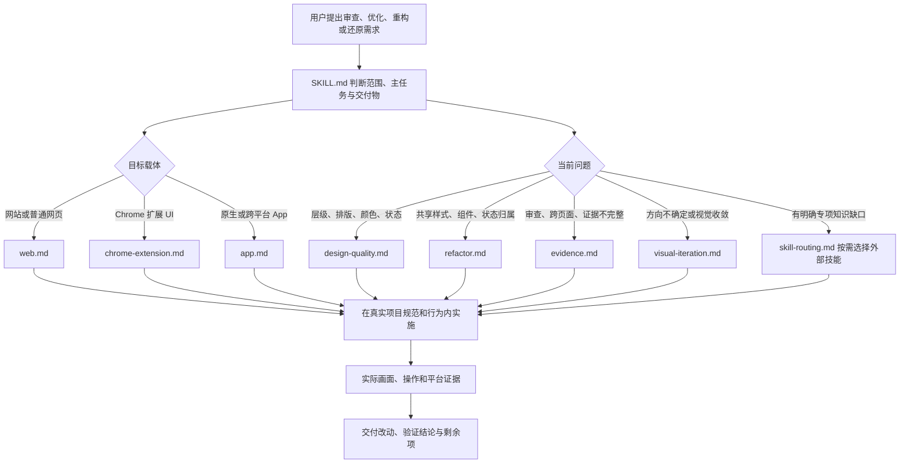
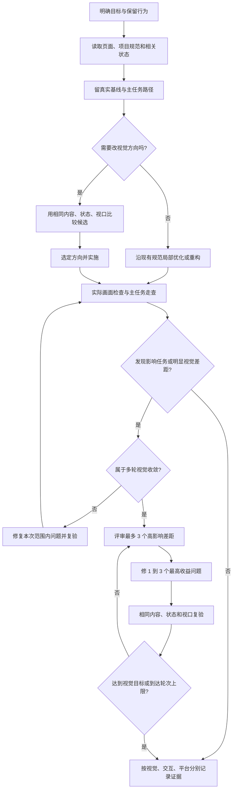

# ui-refine

`ui-refine` 是一个面向 Codex 等代码 Agent 的界面优化技能，帮助 Agent 在现有项目里完成 UI 评审、美化、体验优化、重设计、截图还原和界面代码重构。它覆盖网站、Chrome 扩展界面，以及 iOS、Android、React Native、Flutter、Electron、Tauri 等 App 界面。

它不是一套前端组件库或自动改图程序，而是一组按任务分流的执行说明：先尊重项目已有规范和真实业务行为，再选择合适的平台方法，最后用实际画面和操作证据验证结果。

## 能做什么

| 能力 | 适用场景 | 处理重点 |
| --- | --- | --- |
| 界面审查 | 想知道界面哪里难看、难读或难操作 | 按任务和项目规范定位问题，记录位置、状态、证据、影响、修改位置与优先级；只读审查会给问题和建议 |
| 局部美化与体验优化 | 调整层级、排版、颜色、密度、控件或状态反馈 | 保留有效的品牌方向、内容和主要操作，优先解决遮挡、溢出、阅读与操作失败 |
| 整体改版与方向探索 | 现有风格不适合任务，或用户要求新方向 | 使用相同真实内容、状态和视口比较结构上有差异的小样；按任务选择方向，不只替换颜色 |
| 截图还原 | 按参考图复现界面 | 固定参考尺寸、状态、内容、比例、对齐和裁切，再转成项目中可编辑的控件；截图本身不视为交互实现 |
| 界面代码重构 | 样式漂移、重复组件、UI 状态或职责混乱 | 从共享 token、组件、状态持有者和保存真源入手；保持输入输出、路由、状态值、保存时机和错误恢复 |
| 跨屏与状态检查 | 响应式布局、长内容、加载/空/错误/保存等状态 | 检查目标视口和实际状态；保存操作需确认写入结果并重新读取 |
| 有界视觉迭代 | 用户反馈“不够好看”、方向难定或需要继续收敛 | 留基线、按证据评审、修最高收益差距并复验；最多三轮评审—修改—复验 |
| 外部技能扩展 | 当前任务需要专门设计知识或工具 | 按需引用已安装且相关的技能；外部技能是可选补充，不是运行前置条件 |

## 工作方式

技能先判断任务范围与目标载体，再按需加载对应参考。小改动沿用已有设计规范；跨页面改动、平台生命周期或视觉方向不确定时才加载更完整的流程。参考文件是可组合的工作手册，不会在每个任务中全部读取。



## 执行流程

1. **定范围。** 确认目标页面/屏幕/组件、主任务、技术栈、保留行为、可改范围和交付物。已有对话中已确定的信息继续有效；只在关键缺口影响范围或主要行为时提问。
2. **读取项目真源。** 查看目标页面、共享 token/组件、真实内容和相关状态路径；按目标载体只读必要参考。Monorepo 以目标子应用规范为准。
3. **建立比较依据。** 记录真实内容、状态、任务路径和目标视口。没有真实素材时不编造图片、数据或成功状态；源码结论与实际画面结论分开。
4. **选择实现路径。** 现有方向有效时精修；需要整体改版时探索有结构差异的小样；代码职责或共享样式有问题时从共享真源处理；截图还原则以参考画面为目标。
5. **实施并保持行为。** 从代表区域和主操作链开始，修复共性后再扩展。保留状态含义、保存契约、焦点、导航、恢复和错误路径。
6. **按载体验收。** 查看目标页面的实际结果并执行主要动作。Web 用浏览器；扩展要在已加载的扩展和对应生命周期里检查；原生 App 使用目标模拟器或设备。构建成功不能替代运行验证。
7. **按证据交付。** 分别报告视觉、交互和平台的 `verified`、`partial` 或 `unrun` 状态，附上页面/视口/状态/设备与证据位置，并列出未运行项目。



## 视觉迭代如何收敛

当用户要求整体改版、方向不确定或明确反馈“不够好看”时，读取 [`references/visual-iteration.md`](references/visual-iteration.md)。单个颜色、间距或控件的小修不强行套完整流程。

评审依据同任务基线与实际画面，从五项各 0–2 分记录：任务层级、产品辨识度、构图与排版、组件与细节、尺寸与状态适配。9/10 是视觉目标，不是发布门槛；任务阻断、内容失真、不可读和必要可访问性问题必须单独解决，不能被总分抵消。独立评审只在任务需要且具备隔离与看图条件时采用；否则由执行者自查并明确标注。

每轮以同一内容、状态和视口比较，修复 1–3 个最高收益差距。最多三轮；达到目标且无阻断问题、连续两轮没有可观察改善、用户已经确定方向或超出当前范围时停止。到达上限仍有差距，就交付已验证结果和未解决项，不宣称视觉通过。

## 平台覆盖与专项处理

### 网站与普通网页

检查页面任务、设计 token、共享组件、真实内容和断点。后台重点保留筛选、对象比较和高频操作；营销页重视真实价值、素材、主动作和品牌表达；阅读页检查中文长文、混排、目录、表格和缩放。响应式验收还会关注横向溢出、长标题、焦点、主题及加载/空/错误/成功等受影响状态。

### Chrome 扩展

按 popup、options、side panel、content UI 分别判断空间和生命周期。专项检查包括关闭/重开、切换 tab、扩展重载、宿主页面 SPA、注入清理、存储范围、读写失败、CSP 和权限。`storage.session`、`storage.local`、`storage.sync` 的持久性按实际需求核实，不能用网页预览代替扩展运行证据。

### 原生与跨平台 App

保留 iOS/Android 的 safe area、系统栏、返回导航、字体缩放、主题和辅助功能；RN/Flutter 按每个发行 OS 分别检查。Electron/Tauri 的网页渲染参考 Web 方法，窗口、菜单、快捷键和平台生命周期仍需桌面运行时验证。浏览器手机仿真只能证明对应 Web 视口，不代表原生适配或真机体验。

## 参考文件与实现结构

该仓库是**文档型技能**：没有组件运行时、构建系统、API 服务或强制第三方依赖。入口负责任务分流，其余内容是按需加载的 Markdown playbook；截图、浏览器、模拟器、代码检查等能力由宿主和目标项目提供。

| 文件 | 职责 |
| --- | --- |
| [`SKILL.md`](SKILL.md) | 技能触发条件、范围判断、参考文件路由、实现原则与交付合同 |
| [`agents/openai.yaml`](agents/openai.yaml) | Codex 展示名称、简述和默认调用提示 |
| [`references/web.md`](references/web.md) | 网站与普通网页的布局、可访问性和实际浏览器验收 |
| [`references/chrome-extension.md`](references/chrome-extension.md) | 扩展各 UI 载体、生命周期、存储、注入、CSP 与验证 |
| [`references/app.md`](references/app.md) | 原生 iOS/Android、RN/Flutter、Electron/Tauri 的平台约束和证据边界 |
| [`references/design-quality.md`](references/design-quality.md) | 任务驱动的层级、中文排版、密度、主题、状态、素材和动效判断 |
| [`references/refactor.md`](references/refactor.md) | token、共享组件、UI 状态和展示职责重构的方法及回归范围 |
| [`references/evidence.md`](references/evidence.md) | 问题优先级、取证尺度、状态标记和交付格式 |
| [`references/skill-routing.md`](references/skill-routing.md) | 按实际缺口选择外部技能与工具，并处理冲突和缺失 |
| [`references/visual-iteration.md`](references/visual-iteration.md) | 视觉基线、候选比较、评审标尺、有限轮次和停止条件 |
| [`references/source-notes.md`](references/source-notes.md) | 设计来源、引用范围、平台事实与后续维护边界；常规任务无需读取 |

## 外部技能如何扩展

内置参考可以独立执行。只有存在具体知识或工具缺口时，才从 [`references/skill-routing.md`](references/skill-routing.md) 选择相关且实际可用的技能，例如：

- `impeccable`：专项界面精修、审查与组件提取。
- `ui-ux-pro-max`：可选的设计领域或技术栈检索。
- `wxt-browser-extensions`：项目采用 WXT 时的扩展生命周期、注入和性能规则。
- `shadcn-ui`、`apple-design`、`design-taste-frontend`：分别用于项目已采用的组件原语、适合的交互手感或营销/作品集视觉。

引用技能不表示它已安装，也不要求用户安装。已确认的用户目标、产品事实、平台限制和项目规范优先于外部技能的默认风格偏好；外部技能不能代替实际平台验收。来源选择与借鉴边界见 [`references/source-notes.md`](references/source-notes.md)。

## 使用示例

将仓库放入 Agent 会扫描的 skills 目录，保证目录根部有 `SKILL.md`；之后可以在请求中点名 `$ui-refine`，也可以直接描述任务由 Agent 按技能触发条件识别。

```text
$ui-refine 审查当前商品详情页的首屏，指出影响购买决策的视觉和交互问题，先只读给建议。
```

```text
$ui-refine 优化当前 Chrome side panel。保留当前筛选、草稿和保存行为，重点改窄屏层级，并在真实扩展里验证关闭重开后的状态。
```

```text
$ui-refine 按这张参考图重构设置页，使用项目现有 token 和组件；保留表单值、错误恢复和返回导航，并说明哪些视口/设备尚未验证。
```

技能会依据本机实际可用的浏览器、扩展、模拟器和项目脚本选择验证方式；没有对应环境时仍可完成源码工作，但必须把未运行的画面或平台体验标为 `partial`/`unrun`。

## 维护与来源

核心方法参考 Impeccable 及若干可选设计资料，并由本技能独立整理；本仓库没有复制其运行时或整套 playbook。具体冻结版本、许可证、借鉴点和未覆盖能力列于 [`references/source-notes.md`](references/source-notes.md)。扩展参考或自动化工具前，先定义支持平台、输入输出、依赖、成本、写回与恢复、失败边界，并用真实样例验证。
